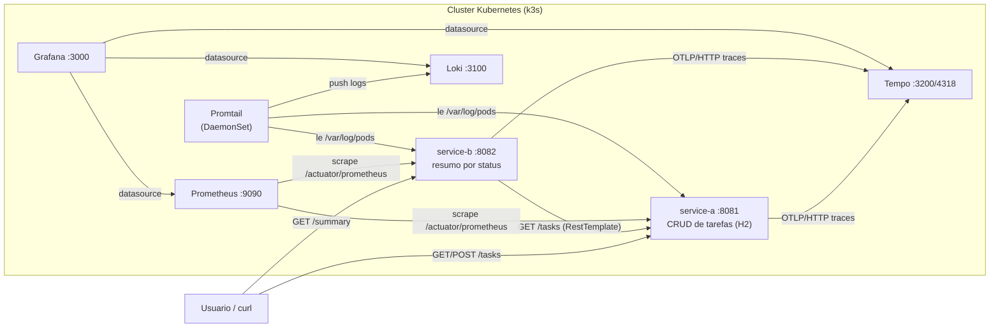

# Projeto de estudo: Kubernetes, Jenkins e Observabilidade com Spring Boot

Repositorio multi-modulo Maven para praticar Kubernetes, Jenkins (CI/CD sem registry
de imagens) e observabilidade, usando dois microsservicos Spring Boot simples:

- **service-a**: API REST de cadastro de tarefas (CRUD), com H2 em memoria.
- **service-b**: consome as tarefas de `service-a` via HTTP e expoe um resumo
  (contagem de tarefas por status).

## Arquitetura



- `service-b` **depende** de `service-a` em runtime (chamada HTTP simples, sem
  service discovery client-side — a resolucao e feita pelo DNS interno do Service
  do Kubernetes). O contexto de trace se propaga nessa chamada, entao uma
  requisicao a `service-b` vira **um unico trace distribuido** com spans dos
  dois servicos (confirmado em teste, ver secao de Traces abaixo).
- `Prometheus` faz *scrape* do endpoint `/actuator/prometheus` dos dois servicos
  (metricas).
- `Promtail` roda como DaemonSet, le os arquivos de log dos pods de `service-a`
  e `service-b` no no do cluster, e envia para o `Loki` (logs).
- `service-a` e `service-b` exportam spans via OTLP/HTTP direto para o `Tempo`
  (traces).
- `Grafana` consome os tres (`Prometheus`, `Loki`, `Tempo`) como data sources,
  provisionados automaticamente com correlacao logs↔traces habilitada.

## Estrutura do repositorio

```
pom.xml                     # POM pai (agrega os modulos)
service-a/                  # API de tarefas (CRUD) + Dockerfile
service-b/                  # Resumo por status + Dockerfile
k8s/manifests/
  service-a/                # Deployment, Service, ConfigMap
  service-b/                # Deployment, Service, ConfigMap
  prometheus/                # Deployment, Service, ConfigMap (scrape config) - metricas
  loki/                       # Deployment, Service, ConfigMap - armazenamento de logs
  promtail/                   # DaemonSet, ConfigMap, RBAC - coleta de logs dos pods
  tempo/                       # Deployment, Service, ConfigMap - armazenamento de traces
  grafana/                   # Deployment, Service, ConfigMap (datasources provisionados)
  sonarqube/                  # Deployment, Service, PVC (analise de qualidade)
Jenkinsfile                 # Pipeline declarativo: build -> testes -> Sonar
                             # -> docker build -> import no k3s -> deploy no k8s
```

## Requisitos

- Java 17 e Maven (para rodar/buildar localmente)
- Docker (para buildar as imagens)
- Um cluster k3s local (ou outro Kubernetes) com `kubectl` configurado
- Jenkins (opcional — so necessario se for rodar o pipeline automatizado)

## Rodando localmente (sem Docker/Kubernetes)

Compile o projeto (reactor multi-modulo):

```
mvn clean package
```

Em dois terminais, suba cada servico:

```
mvn -pl service-a spring-boot:run
mvn -pl service-b spring-boot:run
```

Teste o fluxo:

```
curl -X POST http://localhost:8081/tasks -H "Content-Type: application/json" \
  -d '{"title":"Estudar Kubernetes","status":"PENDENTE"}'

curl http://localhost:8081/tasks
curl http://localhost:8082/summary
```

`service-b` chama `service-a` via a propriedade `service-a.url`, que le a variavel
de ambiente `SERVICE_A_URL` (default `http://localhost:8081` quando rodando fora do
Kubernetes — ver `service-b/src/main/resources/application.yml`).

## Build e deploy manual no k3s (sem Jenkins)

Isso e exatamente o que o Jenkins automatiza depois — util para entender/depurar
cada passo manualmente primeiro.

**1. Build das imagens** (o contexto precisa ser a raiz do repo, pois e um build
Maven multi-modulo — os Dockerfiles copiam o `pom.xml` pai para o Maven resolver o
reactor):

```
docker build -f service-a/Dockerfile -t service-a:latest .
docker build -f service-b/Dockerfile -t service-b:latest .
```

**2. Importar as imagens no containerd do k3s** (nao ha registry externo, entao
o k3s nao consegue dar `pull` — por isso os Deployments usam `imagePullPolicy: Never`
e a imagem precisa ser importada manualmente):

```
docker save service-a:latest | sudo k3s ctr images import -
docker save service-b:latest | sudo k3s ctr images import -
```

**3. Aplicar os manifests** (o `-R` e necessario porque cada componente tem sua
propria subpasta dentro de `k8s/manifests/`; isso ja aplica service-a, service-b,
Prometheus, Loki, Promtail, Tempo, Grafana **e** o SonarQube):

```
kubectl apply -f k8s/manifests/ -R
```

> O SonarQube demora bem mais para ficar pronto que os outros componentes (o
> Elasticsearch embutido pode levar 1-2 minutos para subir) e precisa de mais
> memoria — os `resources` dele em `k8s/manifests/sonarqube/deployment.yaml` sao
> bem maiores que os do service-a/service-b. Acompanhe com
> `kubectl get pods -w` ate o pod do `sonarqube` ficar `Running`/`1/1 Ready`.

**4. Forcar o rollout** caso esteja re-implantando uma imagem nova com a mesma tag
`:latest` (o Kubernetes so percebe uma imagem "nova" se o texto do manifest mudar;
como a tag nao muda, e preciso reiniciar os pods manualmente):

```
kubectl rollout restart deployment/service-a deployment/service-b
kubectl rollout status deployment/service-a --timeout=120s
kubectl rollout status deployment/service-b --timeout=120s
```

**5. Testar dentro do cluster:**

```
kubectl port-forward svc/service-a 8081:8081
kubectl port-forward svc/service-b 8082:8082
```

E repita os `curl` da secao anterior.

## Rodando o pipeline completo via Jenkins

O `Jenkinsfile` na raiz automatiza os passos manuais acima em 7 stages:

1. **Checkout** — traz o codigo do repositorio.
2. **Build (mvn clean package)** — compila e empacota os dois modulos (`-DskipTests`).
3. **Test** — roda `mvn test` e publica os resultados (JUnit) no Jenkins.
4. **SonarQube Analysis** — `mvn sonar:sonar -Dsonar.host.url=http://sonarqube-service:9000`,
   analisando o reactor inteiro e enviando o resultado para o SonarQube do cluster.
5. **Docker Build** — builda `service-a:latest` e `service-b:latest`.
6. **Import images to k3s containerd** — `docker save | sudo k3s ctr images import -`
   para cada imagem.
7. **Deploy to Kubernetes** — `kubectl apply -f k8s/manifests/ -R` seguido de
   `kubectl rollout restart` nos dois Deployments.

> A stage de SonarQube fica **antes** do build da imagem Docker de proposito: nao
> faz sentido gastar tempo empacotando e importando uma imagem se o codigo tiver
> um problema serio de qualidade. Neste pipeline de estudo ela nao *bloqueia* o
> deploy mesmo se o Quality Gate falhar (ver secao "Analise de qualidade" abaixo)
> — numa esteira real, normalmente se adicionaria um `waitForQualityGate abortPipeline: true`
> apos a analise, usando o plugin "SonarQube Scanner for Jenkins" com webhook
> configurado no servidor.

### Pre-requisitos do agente Jenkins

O agente/node que executa o pipeline precisa ter, no `PATH`:

- `mvn` e um JDK 17
- `docker` (com acesso ao daemon — o usuario do Jenkins geralmente precisa estar no
  grupo `docker`)
- `kubectl`, configurado (via `~/.kube/config`) para apontar para o cluster k3s
- `sudo` sem senha para o comando `k3s ctr images import` (ou o agente ja roda como
  root), usado na stage 5

### Criando o job

1. No Jenkins, crie um **Pipeline** (ou **Multibranch Pipeline**, se for usar
   branches).
2. Em **Pipeline > Definition**, escolha **Pipeline script from SCM**, aponte para
   este repositorio e informe `Jenkinsfile` como script path.
3. Rode o build (**Build Now**) e acompanhe as 6 stages na visualizacao do job.

## Observabilidade

Este projeto cobre os tres pilares classicos de observabilidade, cada um com sua
propria ferramenta, todos consumidos a partir de um unico Grafana:

| Pilar    | Ferramenta        | Como os dados chegam ate ela                                   |
|----------|-------------------|------------------------------------------------------------------|
| Metricas | Prometheus        | *scrape* (pull) do endpoint `/actuator/prometheus`               |
| Logs     | Loki + Promtail   | Promtail le os arquivos de log dos pods e *envia* (push) ao Loki |
| Traces   | Tempo             | service-a/service-b *enviam* (push) spans via OTLP/HTTP           |

### Metricas (Prometheus)

Ambos os microsservicos expoem metricas no formato Prometheus via Actuator, no
endpoint `/actuator/prometheus` (dependencia `micrometer-registry-prometheus` +
`management.endpoints.web.exposure.include=...,prometheus` no `application.yml`;
toda metrica vem com a tag `application=service-a` ou `application=service-b`).

O `kubectl apply -f k8s/manifests/ -R` (secao anterior) ja aplica tambem Prometheus
e Grafana. O Prometheus vem configurado (via ConfigMap `prometheus-config`) com o
scrape config abaixo, usando o DNS interno dos Services do Kubernetes:

```yaml
scrape_configs:
  - job_name: 'service-a'
    metrics_path: '/actuator/prometheus'
    static_configs:
      - targets: ['service-a:8081']
  - job_name: 'service-b'
    metrics_path: '/actuator/prometheus'
    static_configs:
      - targets: ['service-b:8082']
```

### Acessando o Prometheus

```
kubectl port-forward svc/prometheus 9090:9090
```

Abra http://localhost:9090/targets e confirme que os dois jobs (`service-a` e
`service-b`) aparecem com estado **UP**.

### Acessando o Grafana

```
kubectl port-forward svc/grafana 3000:3000
```

Abra http://localhost:3000 no navegador.

- **Usuario:** `admin`
- **Senha:** `admin` (definida via env `GF_SECURITY_ADMIN_PASSWORD` no Deployment)

Na primeira vez, o Grafana pode pedir para trocar a senha — pode pular ("Skip")
se for so para estudo local.

Os tres data sources (**Prometheus**, **Loki**, **Tempo**) ja aparecem prontos em
**Connections > Data sources** assim que o Grafana sobe — nao e preciso adicionar
nenhum na mao. Isso e feito via provisioning: um ConfigMap
(`k8s/manifests/grafana/configmap-datasources.yaml`) montado em
`/etc/grafana/provisioning/datasources/`, que o Grafana le automaticamente no
boot. Voce pode conferir em cada data source (botao **Save & test**) que a
conexao esta OK.

> Dashboards prontos continuam **fora** de proposito (pratique montar um manual em
> **Dashboards > New dashboard**) — so os data sources e a correlacao entre eles
> sao provisionados automaticamente, porque configurar a correlacao Loki↔Tempo na
> unha (regex de derived fields) e fácil de errar digitando.

### Logs (Loki + Promtail)

`Promtail` roda como **DaemonSet** (uma instancia por no do cluster - com um so
no no k3s local isso da na mesma que 1 replica, mas e o jeito correto e portavel
de fazer). Ele usa a API do Kubernetes (`kubernetes_sd_configs`, com RBAC proprio
em `k8s/manifests/promtail/rbac.yaml`) para descobrir pods, e o `relabel_configs`
em `k8s/manifests/promtail/configmap.yaml` restringe a coleta **apenas** aos pods
com label `app=service-a` ou `app=service-b` — os logs sao lidos direto de
`/var/log/pods` no no (hostPath) e enviados (push) para o `Loki`.

Acessando o Loki direto (normalmente voce vai preferir consultar via Grafana, mas
para depurar):

```
kubectl port-forward svc/loki 3100:3100
curl http://localhost:3100/ready
```

No Grafana, va em **Explore**, escolha o data source **Loki** e rode uma query
LogQL, por exemplo:

```
{app="service-a"}
```

ou, para ver so os logs de uma tarefa criada:

```
{app="service-a"} |= "Tarefa criada"
```

### Traces (Tempo)

`service-a` e `service-b` tem as dependencias `micrometer-tracing-bridge-otel` +
`opentelemetry-exporter-otlp`, e o `application.yml` de cada um configura:

```yaml
management:
  otlp:
    tracing:
      endpoint: http://localhost:4318/v1/traces   # local; no k8s vira tempo-service via ConfigMap
  tracing:
    sampling:
      probability: 1.0   # 100% das requisicoes - errado para producao, ideal para estudar
```

No cluster, o ConfigMap de cada servico sobrescreve o endpoint via
`MANAGEMENT_OTLP_TRACING_ENDPOINT=http://tempo-service:4318/v1/traces` (mesmo
padrao de override usado no `SERVICE_A_URL`).

Como `service-b` chama `service-a` atraves do `RestTemplate` auto-configurado
(`RestTemplateBuilder`), o contexto do trace se propaga automaticamente entre os
dois servicos — **testamos e confirmamos**: um `GET /summary` em `service-b` gera
**um unico trace** no Tempo com 3 spans: `http get /summary` (server, service-b) →
`http get` (client, service-b chamando service-a) → `http get /tasks` (server,
service-a), ligados por `parentSpanId`. Isso e tracing distribuido de verdade,
nao so instrumentacao isolada por servico.

No Grafana, va em **Explore**, escolha o data source **Tempo** e busque por
service name (`service-a` ou `service-b`) ou cole um trace ID direto.

### Visualizando os tres pilares juntos

O roteiro abaixo e o que fizemos durante o desenvolvimento deste projeto para
validar a integracao ponta a ponta - sirva de guia para explorar voce mesmo:

1. **Gere uma requisicao real:**
   ```
   kubectl port-forward svc/service-a 8081:8081 &
   curl -X POST http://localhost:8081/tasks -H "Content-Type: application/json" \
     -d '{"title":"Ver os 3 pilares","status":"PENDENTE"}'
   ```

2. **Metrica (Prometheus):** no Grafana, **Explore > Prometheus**, rode
   `http_server_requests_seconds_count{uri="/tasks", application="service-a"}` e
   veja o contador subir.

3. **Log (Loki):** **Explore > Loki**, rode `{app="service-a"} |= "Tarefa criada"`.
   Voce vai ver uma linha como:
   ```
   ... [065016f9a5d70907509f9a4681e331a0-2520aa7e59283ccf] c.p.servicea.controller.TaskController : Tarefa criada: id=1 title=... status=PENDENTE
   ```
   O trecho entre colchetes e `traceId-spanId` (Spring Boot injeta isso
   automaticamente no log quando o Micrometer Tracing esta ativo).

4. **Trace (Tempo):** ao lado dessa linha de log no Grafana, um botao **Tempo**
   aparece (gracas ao `derivedFields` provisionado) — clique nele para abrir o
   trace exato daquela requisicao, com a linha do tempo dos spans
   (`http post /tasks`, chamadas ao banco H2 via instrumentacao JDBC, etc). Se
   estiver seguindo o exemplo de `service-b` (`GET /summary`), o mesmo trace vai
   mostrar os spans de **ambos os servicos** na mesma linha do tempo.

Esse fluxo — metrica aponta que algo aconteceu, log explica o que foi, trace
mostra onde o tempo foi gasto e por quais servicos a requisicao passou — e o
motivo de se ter os 3 pilares juntos em vez de só um.

## Analise de qualidade com SonarQube

O `pom.xml` pai declara o `sonar-maven-plugin` (`org.sonarsource.scanner.maven`),
entao `mvn sonar:sonar` (rodado a partir da raiz) analisa o reactor inteiro —
`service-a` e `service-b` juntos, na mesma execucao.

O SonarQube roda como um componente a mais no cluster
(`k8s/manifests/sonarqube/`): `Deployment` com `PersistentVolumeClaim` (para os
dados de analise sobreviverem a reinicios do pod) e `Service` chamado
`sonarqube-service`, que e o nome usado pelo Jenkinsfile em
`-Dsonar.host.url=http://sonarqube-service:9000`.

### Acessando a interface do SonarQube

```
kubectl port-forward svc/sonarqube-service 9000:9000
```

Abra http://localhost:9000 no navegador.

- **Usuario:** `admin`
- **Senha:** `admin` (senha padrao de uma instalacao nova do SonarQube — ele vai
  pedir para trocar no primeiro login)

Depois da primeira analise (`mvn sonar:sonar` local, ou via stage do Jenkins), o
projeto aparece na tela inicial como **um unico projeto**, chamado
`com.practica:k8s-jenkins-observability-lab` (o `groupId:artifactId` do POM pai) —
o `sonar-maven-plugin` roda no reactor inteiro e agrega `service-a` e `service-b`
num so projeto no SonarQube, cada um aparecendo como uma "pasta" dentro dele
(nao como dois projetos separados).

> Numa instalacao nova, o token padrao `admin`/`admin` funciona direto na API,
> mas a UI forca a troca de senha no primeiro login. Para rodar a analise (local
> ou no Jenkins) e preciso gerar um token em **My Account > Security > Generate
> token** e passar via `-Dsonar.token=<token>` — sem isso, a partir da versao
> usada aqui o SonarQube responde `401 Unauthorized` mesmo para o `sonar.host.url`
> correto (testamos e confirmamos esse comportamento).

### Interpretando o resultado (Quality Gate)

Ao abrir um projeto, o SonarQube mostra um selo grande no topo:

- 🟢 **Passed** — o codigo passou em todas as condicoes configuradas no Quality
  Gate (o padrao, "Sonar way", cobre coisas como: sem bugs/vulnerabilidades novos,
  cobertura minima de testes no codigo novo, duplicacao de codigo abaixo de um
  limite, etc.)
- 🔴 **Failed** — pelo menos uma condicao do Quality Gate nao foi atendida.
  Clique no card **Quality Gate** (ou na aba correspondente) para ver **qual**
  condicao especifica falhou (ex.: "Coverage on New Code is less than 80%").

> **Pegadinha comum:** rodamos a primeira analise deste projeto (sem nenhum
> teste ainda, 0% de cobertura) e o Quality Gate veio **Passed** mesmo assim.
> Isso acontece porque a maioria das condicoes do "Sonar way" e sobre **codigo
> novo** ("new code"), e numa primeira analise ainda nao existe um periodo
> anterior para comparar — so a partir da segunda analise em diante essas
> condicoes passam a valer de verdade. Nao interprete um selo verde na primeira
> analise como "o codigo esta bom"; olhe a aba **Measures** para os numeros
> absolutos (cobertura, bugs, code smells, etc).

Nas abas de cada projeto:

- **Issues** — lista bugs, vulnerabilidades e "code smells" encontrados, com
  severidade (Blocker/Critical/Major/Minor/Info) e o trecho de codigo apontado.
  Exemplo real encontrado neste projeto: a regra `java:S4684` marca como
  **vulnerabilidade** o `TaskController` receber a entidade JPA `Task` direto
  via `@RequestBody` (deveria usar um DTO em vez de expor a entidade de
  persistencia na API) — um otimo ponto de partida para uma proxima iteracao
  do projeto.
- **Security Hotspots** — pontos que merecem revisao manual de seguranca (nem
  sempre sao vulnerabilidades confirmadas, mas pontos de atencao).
- **Measures** — metricas agregadas: cobertura de testes, duplicacao, complexidade
  ciclomatica, linhas de codigo, etc.

> Como este projeto ainda nao tem classes de teste (ver stage **Test** do
> Jenkinsfile), espere o SonarQube reclamar de cobertura de testes baixa/zerada —
> e um otimo primeiro exercicio: escrever um teste, rodar a analise de novo e ver
> a metrica de cobertura mudar.
>
> O `Jenkinsfile` deste projeto **nao** interrompe o pipeline se o Quality Gate
> falhar (e so um `mvn sonar:sonar`, sem checagem do resultado) — e proposital,
> para manter o pipeline de estudo simples. Para bloquear o deploy quando o
> Quality Gate falha, o proximo passo natural seria configurar um webhook do
> SonarQube apontando para o Jenkins e usar os steps `waitForQualityGate` do
> plugin "SonarQube Scanner for Jenkins".
